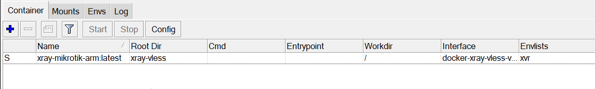
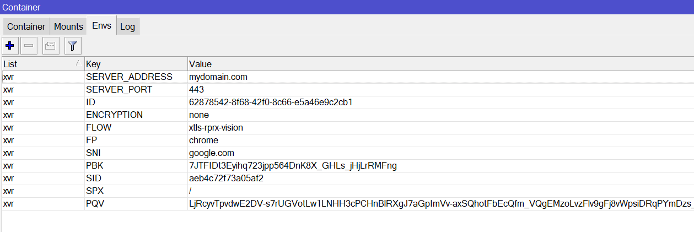
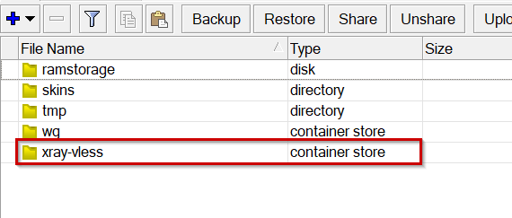

# :sparkles: XRay Vless Reality + MikroTik :sparkles:


:dizzy: Аналог [AmneziaWG + MikroTik](https://github.com/catesin/AmneziaWG-MikroTik)


В данном репозитории рассматривается работа MikroTik RouterOS V7.20.6+ с протоколом **XRay Vless Reality**. В процессе настройки, относительно вашего оборудования, следует выбрать вариант реализации с [контейнером](https://help.mikrotik.com/docs/display/ROS/Container) внутри RouterOS или без контейнера. 

Предполагается что вы уже настроили серверную часть Xray например [с помощью панели управления 3x-ui](https://github.com/MHSanaei/3x-ui) и протестировали конфигурацию клиента, например на смартфоне или персональном ПК.

:school: Внимание! Инструкция среднего уровня сложности. Перед применением настроек вам необходимо иметь опыт в настройке MikroTik уровня сертификации MTCNA. 

В репозитории присутствует инструкция с [готовыми](https://hub.docker.com/u/catesin) контейнерами и шаблоны для самостоятельной сборки в каталоге **"Containers"**. Контейнеры делятся на три архитектуры **ARM, ARM64 и x86**.

Вариант №2 без контейнера подойдёт к любому домашнему роутеру который хоть немного умеет работать с аналогичными в MikroTik адрес-листами или имеет расширенный функционал по маршрутизации.

------------

* [Преднастройка RouterOS](#Pre_edit)
* [Вариант №1. RouterOS с контейнером](#R_Xray_1)
	- [Готовые контейнеры](#R_Xray_1_build_ready)
	- [Настройка контейнера в RouterOS](#R_Xray_1_settings)
* [Вариант №2. RouterOS без контейнера](#R_Xray_2)
	- [Установка Debian Linux](#R_Xray_2_installDebian)
	- [Настройка Debian](#R_Xray_2_setupDebian)
	- [Настройка конфигурации Xray](#R_Xray_2_setup)
	- [Настройка роутера](#R_Xray_2_setup_router)
	

------------

<a name='Pre_edit'></a>
## Преднастройка RouterOS

Создадим отдельную таблицу маршрутизации:
```
/routing table 
add disabled=no fib name=r_to_vpn
```
Добавим address-list "to_vpn" что бы находившиеся в нём IP адреса и подсети заворачивать в пока ещё не созданный туннель
```
/ip firewall address-list
add address=172.217.168.206 list=to_vpn
```
Добавим address-list "RFC1918" что бы не потерять доступ до RouterOS при дальнейшей настройке
```
/ip firewall address-list
add address=10.0.0.0/8 list=RFC1918
add address=172.16.0.0/12 list=RFC1918
add address=192.168.0.0/16 list=RFC1918
```

Добавим правила в mangle для address-list "RFC1918" и переместим его в самый верх правил
```
/ip firewall mangle
add action=accept chain=prerouting dst-address-list=RFC1918 in-interface-list=!WAN
```

Добавим правило транзитного трафика в mangle для address-list "to_vpn"
```
/ip firewall mangle
add action=mark-connection chain=prerouting connection-mark=no-mark dst-address-list=to_vpn in-interface-list=!WAN \
    new-connection-mark=to-vpn-conn passthrough=yes
```
Добавим правило для транзитного трафика отправляющее искать маршрут до узла назначения через таблицу маршрутизации "r_to_vpn", созданную на первом шаге
```
add action=mark-routing chain=prerouting connection-mark=to-vpn-conn in-interface-list=!WAN new-routing-mark=r_to_vpn \
    passthrough=yes
```
Маршрут по умолчанию в созданную таблицу маршрутизации "r_to_vpn" добавим чуть позже.

:exclamation:Два выше обозначенных правила будут работать только для трафика, проходящего через маршрутизатор. 
Если вы хотите заворачивать трафик, генерируемый самим роутером (например команда ping 172.217.168.206 c роутера для проверки туннеля в контейнере), тогда добавляем ещё два правила (не обязательно). 
Они должны находиться по порядку, следуя за вышеобозначенными правилами.
```
/ip firewall mangle
add action=mark-connection chain=output connection-mark=no-mark \
    dst-address-list=to_vpn new-connection-mark=to-vpn-conn-local \
    passthrough=yes
add action=mark-routing chain=output connection-mark=to-vpn-conn-local \
    new-routing-mark=r_to_vpn passthrough=yes
```

------------
<a name='R_Xray_1'></a>
## Вариант №1. RouterOS с контейнером

### RouterOS с контейнером

Данный пункт настройки подходит только для устройств с архитектурой **ARM, ARM64 или x86**. 
Перед запуском контейнера в RouteOS убедитесь что у вас [включены контейнеры](https://help.mikrotik.com/docs/spaces/ROS/pages/84901929/Container). 
С полным списком поддерживаемых устройств можно ознакомится [тут](https://mikrotik.com/products/matrix). 

:warning: Предполагается что на устройстве (или если есть USB порт с флешкой) имеется +- 40 Мбайт свободного места для разворачивания контейнера внутри RouterOS. Сам контейнер весит не более 30 Мбайт. Если места не хватает, его можно временно расширить [за счёт оперативной памяти](https://help.mikrotik.com/docs/spaces/ROS/pages/91193346/Disks#Disks-AllocateRAMtofolder). После перезагрузки RouterOS, всё что находится в RAM, стирается. 

### Включение функции контейнеров в RouterOS

Основная инструкция по включению функции контейнеров находится [ТУТ](https://help.mikrotik.com/docs/spaces/ROS/pages/84901929/Container#Container-Summary) или [ТУТ](https://www.google.com/search?q=%D0%9A%D0%B0%D0%BA+%D0%B2%D0%BA%D0%BB%D1%8E%D1%87%D0%B8%D1%82%D1%8C+%D0%BA%D0%BE%D0%BD%D1%82%D0%B5%D0%B9%D0%BD%D0%B5%D1%80%D1%8B+%D0%B2+mikrotik&oq=%D0%BA%D0%B0%D0%BA+%D0%B2%D0%BA%D0%BB%D1%8E%D1%87%D0%B8%D1%82%D1%8C+%D0%BA%D0%BE%D0%BD%D1%82%D0%B5%D0%B9%D0%BD%D0%B5%D1%80%D1%8B+%D0%B2+mikrotik)

Порядок действий выглядит так: 

* Обновляемся до последней версии RouterOS
* Скачиваем дополнительный пакет из расширений "all packages" на [официальном сайте](https://mikrotik.com/download)
* Устанавливаем пакет
* Включаем функцию контейнеров

<a name='R_Xray_1_build_ready'></a>
### Готовые контейнеры

**Где взять контейнер?** Его можно собрать самому из текущего репозитория каталога **"Containers"** или скачать готовый образ под выбранную архитектуру из [Docker Hub](https://hub.docker.com/u/catesin).
Скачав готовый образ [переходим сразу к настройке](#R_Xray_1_settings).


Для самостоятельной сборки следует установить подсистему Docker [buildx](https://github.com/docker/buildx?tab=readme-ov-file), "make" и "go".

В текущем примере будем собирать на Windows:
1) Скачиваем [Docker Desktop](https://docs.docker.com/desktop/) и устанавливаем
2) Скачиваем каталог **"Containers"**
3) Открываем CMD и переходим в каталог **"Containers"** (cd <путь до каталога>)
4) Запускаем Docker с ярлыка на рабочем столе (окно приложения должно просто висеть в фоне при сборке) и через cmd собираем контейнер под выбранную архитектуру RouterOS

- ARMv8 (arm64/v8) — спецификация 8-го поколения оборудования ARM, которое поддерживает архитектуры AArch32 и AArch64.
- ARMv7 (arm/v7) — спецификация 7-го поколения оборудования ARM, которое поддерживает только архитектуру AArch32. 
- AMD64 (amd64) — это 64-битный процессор, который добавляет возможности 64-битных вычислений к архитектуре x86

Для ARMv8 (Containers\Dockerfile_arm64)
```
docker image prune -f

docker buildx build -f Dockerfile_arm64 --no-cache --progress=plain --platform linux/arm64/v8 --output=type=docker --tag user/docker-xray-vless:latest .
```

Для ARMv7 (Containers\Dockerfile_arm)
```
docker image prune -f

docker buildx build -f Dockerfile_arm --no-cache --progress=plain --platform linux/arm/v7 --output=type=docker --tag user/docker-xray-vless:latest .
```

Для amd64 (Containers\Dockerfile_amd64)
```
docker image prune -f

docker buildx build -f Dockerfile_amd64 --no-cache --progress=plain --platform linux/amd64 --output=type=docker --tag user/docker-xray-vless:latest .
```
Иногда процесс создания образа может подвиснуть из-за плохого соединения с интернетом. Следует повторно запустить сборку. 
После сборки образа вы можете загрузить контейнер в приватный репозиторий Docker HUB и продолжить настройку по [следующему пункту](#R_Xray_1_settings)

<a name='R_Xray_1_settings'></a>
### Настройка контейнера в RouterOS

В текущем примере на устройстве MikroTik флешки нет. Хранить будем всё в корне.
Если у вас есть USB порт и флешка, лучше размещать контейнер на ней.  Можно комбинировать память загрузив контейнер в расшаренный диск [за счёт оперативной памяти](https://www.youtube.com/watch?v=uZKTqRtXu4M), а сам контейнер разворачивать в постоянной памяти.

Рекомендую создать пространство из ОЗУ хотя бы для tmp директории. Размер регулируйте самостоятельно:
```
/disk
add slot=ramstorage tmpfs-max-size=100M type=tmpfs
```

:exclamation:**Если контейнер не запускается на флешке.**
Например, вы хотите разместить контейнер в каталоге /usb1/docker/xray. Не создавайте заранее каталог xray на USB-флеш-накопителе. При создании контейнера добавьте в команду распаковки параметр "root-dir=usb1/docker/xray", в этом случае контейнер распакуется самостоятельно создав каталог /usb1/docker/xray и запустится без проблем.

**В RouterOS выполняем:**

0) Подключим Docker HUB в наш RouterOS

```
/container config set tmpdir=ramstorage

/container/config/set registry-url=https://registry-1.docker.io tmpdir=/ramstorage
```

1) Создадим интерфейс для контейнера
```
/interface veth add address=172.18.20.6/30 gateway=172.18.20.5 gateway6="" name=docker-xray-vless-veth
```

2) Добавим правило в mangle для изменения mss для трафика, уходящего в контейнер. Поместите его после правила с RFC1918 (его мы создали ранее).
```
/ip firewall mangle add action=change-mss chain=forward new-mss=1360 out-interface=docker-xray-vless-veth passthrough=yes protocol=tcp tcp-flags=syn tcp-mss=1420-65535
```

3) Назначим на созданный интерфейс IP адрес. IP 172.18.20.6 возьмёт себе контейнер, а 172.18.20.5 будет адрес RouterOS.
```
/ip address add interface=docker-xray-vless-veth address=172.18.20.5/30
```
4) В таблице маршрутизации "r_to_vpn" создадим маршрут по умолчанию ведущий на контейнер
```
/ip route add distance=1 dst-address=0.0.0.0/0 gateway=172.18.20.6 routing-table=r_to_vpn
```
5) Включаем masquerade для всего трафика, уходящего в контейнер.
```
/ip firewall nat add action=masquerade chain=srcnat out-interface=docker-xray-vless-veth
```
6) Создадим переменные окружения envs под названием "xvr", которые позже при запуске будем передавать в контейнер.
Параметры подключения Xray Vless вы должны взять из сервера панели 3x-ui. 

:anger: Пример импортируемой строки из 3x-ui раздела клиента "Details" (у вас настройки должны быть сгенерированы свои):
```
vless://62878542-8f68-42f0-8c66-e5a46e9c2cb1@mydomain.com:443?type=tcp&encryption=none&security=reality&pbk=7JTFIDt3Eyihq723jpp564DnK8X_GHLs_jHjLrRMFng&fp=chrome&sni=google.com&sid=aeb4c72f73a05af2&spx=%2F&pqv=LjRcyvTpvdwE2DV-s7rUGVotLw1LNHH3cPCHnBlRXgJ7aGpImVv-axSQhotFbEcQfm_VQgEMzoLvzFlv9gFj8vWpsiDRqPYmDzs_3ZsTNJVx-X9dmrXuqMvenoEw-wc5OtITk5kOTks62ipPkem3ZX4aLzhNH9BhK-H4XE3nJybcpNc3yOBH1OwOBDV6OnpDXexqsbxuCJPBoUgW8TY8hW5GqSHKs7hg1sSegM_App-CLjMhnL3_u3T41B7pbI0ScRj63wLT9oz_i3DxoMHiz1o57XkxUTvS3f-YoFlUhs6LHXCeEwDU1TRkd-tQuNx3xK1fMbgxaK-Tk2YVD25L7-eWEOiZ2yiED_kRIZWH-1TjEPSvB9rIPYBlQTUxa4T4zIkbnCRDStu4nx4mqJg2cAFQqJXAmuyKGyuTEHBqPLJSpnQJ1es9BFCDEEXstkD3vzVBDpFNl0DZcTh9yDFMz7WDSX5LGuwOkywKhvSXBUG42ZtWpZVkFnGJmRIkkvs8-LoY1AvbVy52ylhSvfDsjIk6WeKhyBRfT5WRhWfO5rUdQeN8c8gD7WMTqCLAci1QChXLQRleD8irni1a-40C4h1UNWFBCj8MrZw8O9k5jxIvoVFyTOxkeepv_Ll8Pb6lb4qeO0wKfjACHnQBq6psWRABCUuUKPmEwllACQk44wDpfdpcl4oKHM5-lQ9nzuOo_-THMZRKH1zjYLi5bUH_NQu7BEyZjXNBakV5bEq6FtNxWO9kCB2Ny7NeGelLL7xdg2Je30AMTEHMMymq1mNWL5R926TdGMTuJYHx49YfIygcZJaZWc8h_YCGs53lsGMG6vCBRHfF72J_bqKAndKWd8atC1ivxmGayMomfwaT85QitSQ-U7ka4nzktgnim4qsoMarwWwrteWQkjelGHCZl3RyGQoLZaNl_aV2YHn2QRQ0GyJdaJylJpnYfbUrQZymz8aF2-3HAtVos18vJrKEdpxpgyVth5JzPO8VSlzolYMuR_CCEJnd-aw27iBR-XStYfmTNqEe93nLNbpfr3h6M4avVFTbZQsqpD7V4CC3wAHhpemx2s9NyH-qnSmyBLMsM1t4XxjPBJ-6vEXyZOJ0bgaV4jF9NZ2XnuY64fRf1RrNEZOmA3-t2cGs2j5qROqE7r3ZppEpBqt9hJys5aWOZfYxpgAi-79O9ArjsngGAtOR2mxXsJJd77LT5K_P9jCZSd3GoCFdJBhenI4e2UO4YjWTfwUV8tchRUE-0lI09DkkVwwpxumxvjVt4SXzcDw0Zrr59mMvWFHT14IQ20pRoI64uizd2nGvXJ3E4_bxwi2GEmlqheTo2IYfqVnLzJ2HzM1TYvPGMH_DILdDMQRjlYFJURSYEaCPc2ebjdz1PJZglV01eQkZh3S18FE2C7CqvKAIwqpTLk5FA_ZYZ5pzCFMMyR9Gjrsm9GXlyjlVbcz2Z51aXj905qjoJ0hUesIgK3tAuDShrD7BgCek0711DQRfil02GbLMeHV7UAAPA61IKrEZq2gfM4IBWA-BfY8sI8E005OLDqn8BRp0AlilG0RO-fOA6xverjKtJTdRR8tU8b7HA57Ht9im42hrgcwV7hFVK_sMn-MxrS5ZqRn-bEwthWlgL6avDJQKnu94ykPOfcjzvPFamjusGjOJtgYWslMiKXjRh0VgD3zuXaPz14FENpiCPYf2z-aYU3ZaJHa2-Ri2uww6BT6zHJvRY4qwDjbga8RuvPH9_dBjWK8HjNpqkOlcvacgbRe_-wqIFkX7oFSNzZwOBgbqFUSPGS2lWZeHHO5n5caBazcmGnf5qZI75BKbVs196Vp0aGOu_tWkQb98XwJB7xrAocMTMyqT63AJG5sUQ4k9_dta0Gnp1CfQQTbaoodL4UizK6JUgubKmLcYX_zdclnBySJAfDQGvnDBO6mhlnN7TJ0gB_wQ4AdLeXJtQn0CmABSVsL3IiRYNBp6BWrntBS26Kt1GAhatRAC4leUU-XrtCHof9zf4KbCQvxl2GN2ducRPpZrzxAXNpIY6yAXVQTVGxutHgsdEbzdSXVYyS7P4rK0idr_DFTTZvSoYJIJ4cBmPWL1yQW-c-NBwYOGotZvJPdoNSEzo5_6RwL1fsA23MDcbnsps15z-iIDophqddg56z3PN9PUi8kFc3vqjxhD9usDXOv1vFLzawZHPstH2Jx2zIMrceBHa8ShZcUVws7iWxwF4Ie9ciaOwLXgiLw8IZm0-wb4tLdCvJwQjN2v2R3Are4PulLcma7J6gEiVKdT9-wA2A1M4W-o916UaTSs2llielbh92UDOti-2L_u5CoGBNxjtlQ8ZKyFJxxtwl6tsEgwvV2FHFCt-BfEJ6kSrYVTnsexi03kf8STuE_QJNgouUgYdC9xRqg-KvcIW3Ag_FcACaqIE5YDM7rvVeKNz-F8JgxqMIThA95_sLxzeAqzfBci0i3Hq7qXCphKKILHmh-OK0Fmz93fbc1-VKkQqCKl0VqygsxAafGW15nTW-qYgeoxOQPLud0Mzh7gZdwzenc8a65dwH8pvZGzoayBmRGgOf91IcRxFTMyxkwrVkav5qIt1lMto62VgPkR2PTrWDUlAHA&flow=xtls-rprx-vision#4xg43kggm
```
Размещаем данные параметры для передачи в контейнер


|   **Переменная**   |             **Пример значения**             | **Пояснение**                                    |
| :----------------: | :-----------------------------------------: | :----------------------------------------------- |
| **SERVER_ADDRESS** |             mydomain.com                    | Адрес Xray сервера                               |
|   **SERVER_PORT**  |                     443                     | Порт сервера                                     |
|       **ID**       |     62878542-8f68-42f0-8c66-e5a46e9c2cb1    | UUID клиента VLESS                               |
|   **ENCRYPTION**   |                     none                    | Для VLESS всегда `none`                          |
|      **FLOW**      |               xtls-rprx-vision              | Flow для Xray (Vision / другие)                  |
|       **FP**       |                    chrome                   | Fingerprint REALITY (браузерная маскировка)      |
|       **SNI**      |                  google.com                 | SNI для TLS / REALITY                            |
|       **PBK**      | 7JTFIDt3Eyihq723jpp564DnK8X_GHLs_jHjLrRMFng | Публичный ключ REALITY                           |
|       **SID**      |               aeb4c72f73a05af2              | ShortId REALITY                                  |
|       **SPX**      |                      /                      | Путь SpiderX для REALITY                         |
|       **PQV**      |      LjRcyvTpvdwE2DV-s7rUGVotLw1LNH…        | PQV (post-quantum value), сокращено для удобства |

```
/container envs
add key=SERVER_ADDRESS list=xvr value=mydomain.com
add key=SERVER_PORT list=xvr value=443
add key=ID list=xvr value=62878542-8f68-42f0-8c66-e5a46e9c2cb1
add key=ENCRYPTION list=xvr value=none
add key=FLOW list=xvr value=xtls-rprx-vision
add key=FP list=xvr value=chrome
add key=SNI list=xvr value=google.com
add key=PBK list=xvr value=7JTFIDt3Eyihq723jpp564DnK8X_GHLs_jHjLrRMFng
add key=SID list=xvr value=aeb4c72f73a05af2
add key=SPX list=xvr value=/
add key=PQV list=xvr value="LjRcyvTpvdwE2DV-s7rUGVotLw1LNHH3cPCHnBlRXgJ7aGpImVv-axSQhotFbEcQfm_VQgEMzoLvzFlv9gFj8vWpsiDRqPYmDzs_3ZsTNJVx-X9dmrXuqMvenoEw-wc5OtITk5kOTks62ipPkem3ZX4aLzhNH9BhK-H4XE3nJybcpNc3yOBH1OwOBDV6OnpDXexqsbxuCJPBoUgW8TY8hW5GqSHKs7hg1sSegM_App-CLjMhnL3_u3T41B7pbI0ScRj63wLT9oz_i3DxoMHiz1o57XkxUTvS3f-YoFlUhs6LHXCeEwDU1TRkd-tQuNx3xK1fMbgxaK-Tk2YVD25L7-eWEOiZ2yiED_kRIZWH-1TjEPSvB9rIPYBlQTUxa4T4zIkbnCRDStu4nx4mqJg2cAFQqJXAmuyKGyuTEHBqPLJSpnQJ1es9BFCDEEXstkD3vzVBDpFNl0DZcTh9yDFMz7WDSX5LGuwOkywKhvSXBUG42ZtWpZVkFnGJmRIkkvs8-LoY1AvbVy52ylhSvfDsjIk6WeKhyBRfT5WRhWfO5rUdQeN8c8gD7WMTqCLAci1QChXLQRleD8irni1a-40C4h1UNWFBCj8MrZw8O9k5jxIvoVFyTOxkeepv_Ll8Pb6lb4qeO0wKfjACHnQBq6psWRABCUuUKPmEwllACQk44wDpfdpcl4oKHM5-lQ9nzuOo_-THMZRKH1zjYLi5bUH_NQu7BEyZjXNBakV5bEq6FtNxWO9kCB2Ny7NeGelLL7xdg2Je30AMTEHMMymq1mNWL5R926TdGMTuJYHx49YfIygcZJaZWc8h_YCGs53lsGMG6vCBRHfF72J_bqKAndKWd8atC1ivxmGayMomfwaT85QitSQ-U7ka4nzktgnim4qsoMarwWwrteWQkjelGHCZl3RyGQoLZaNl_aV2YHn2QRQ0GyJdaJylJpnYfbUrQZymz8aF2-3HAtVos18vJrKEdpxpgyVth5JzPO8VSlzolYMuR_CCEJnd-aw27iBR-XStYfmTNqEe93nLNbpfr3h6M4avVFTbZQsqpD7V4CC3wAHhpemx2s9NyH-qnSmyBLMsM1t4XxjPBJ-6vEXyZOJ0bgaV4jF9NZ2XnuY64fRf1RrNEZOmA3-t2cGs2j5qROqE7r3ZppEpBqt9hJys5aWOZfYxpgAi-79O9ArjsngGAtOR2mxXsJJd77LT5K_P9jCZSd3GoCFdJBhenI4e2UO4YjWTfwUV8tchRUE-0lI09DkkVwwpxumxvjVt4SXzcDw0Zrr59mMvWFHT14IQ20pRoI64uizd2nGvXJ3E4_bxwi2GEmlqheTo2IYfqVnLzJ2HzM1TYvPGMH_DILdDMQRjlYFJURSYEaCPc2ebjdz1PJZglV01eQkZh3S18FE2C7CqvKAIwqpTLk5FA_ZYZ5pzCFMMyR9Gjrsm9GXlyjlVbcz2Z51aXj905qjoJ0hUesIgK3tAuDShrD7BgCek0711DQRfil02GbLMeHV7UAAPA61IKrEZq2gfM4IBWA-BfY8sI8E005OLDqn8BRp0AlilG0RO-fOA6xverjKtJTdRR8tU8b7HA57Ht9im42hrgcwV7hFVK_sMn-MxrS5ZqRn-bEwthWlgL6avDJQKnu94ykPOfcjzvPFamjusGjOJtgYWslMiKXjRh0VgD3zuXaPz14FENpiCPYf2z-aYU3ZaJHa2-Ri2uww6BT6zHJvRY4qwDjbga8RuvPH9_dBjWK8HjNpqkOlcvacgbRe_-wqIFkX7oFSNzZwOBgbqFUSPGS2lWZeHHO5n5caBazcmGnf5qZI75BKbVs196Vp0aGOu_tWkQb98XwJB7xrAocMTMyqT63AJG5sUQ4k9_dta0Gnp1CfQQTbaoodL4UizK6JUgubKmLcYX_zdclnBySJAfDQGvnDBO6mhlnN7TJ0gB_wQ4AdLeXJtQn0CmABSVsL3IiRYNBp6BWrntBS26Kt1GAhatRAC4leUU-XrtCHof9zf4KbCQvxl2GN2ducRPpZrzxAXNpIY6yAXVQTVGxutHgsdEbzdSXVYyS7P4rK0idr_DFTTZvSoYJIJ4cBmPWL1yQW-c-NBwYOGotZvJPdoNSEzo5_6RwL1fsA23MDcbnsps15z-iIDophqddg56z3PN9PUi8kFc3vqjxhD9usDXOv1vFLzawZHPstH2Jx2zIMrceBHa8ShZcUVws7iWxwF4Ie9ciaOwLXgiLw8IZm0-wb4tLdCvJwQjN2v2R3Are4PulLcma7J6gEiVKdT9-wA2A1M4W-o916UaTSs2llielbh92UDOti-2L_u5CoGBNxjtlQ8ZKyFJxxtwl6tsEgwvV2FHFCt-BfEJ6kSrYVTnsexi03kf8STuE_QJNgouUgYdC9xRqg-KvcIW3Ag_FcACaqIE5YDM7rvVeKNz-F8JgxqMIThA95_sLxzeAqzfBci0i3Hq7qXCphKKILHmh-OK0Fmz93fbc1-VKkQqCKl0VqygsxAafGW15nTW-qYgeoxOQPLud0Mzh7gZdwzenc8a65dwH8pvZGzoayBmRGgOf91IcRxFTMyxkwrVkav5qIt1lMto62VgPkR2PTrWDUlAHA"
```

7) Теперь создадим сам контейнер. Здесь вам нужно выбрать репозиторий из [Docker Hub](https://hub.docker.com/u/catesin) с архитектурой под ваше устройство. не создавайте заранее каталог для параметра "root-dir"

*  Для ARMv7 (arm)
```
/container add hostname=xray-vless interface=docker-xray-vless-veth envlist=xvr root-dir=xray-vless logging=yes start-on-boot=yes remote-image=catesin/xray-mikrotik-arm:latest
```

* Для ARMv8 (arm64)
```
/container add hostname=xray-vless interface=docker-xray-vless-veth envlist=xvr root-dir=xray-vless logging=yes start-on-boot=yes remote-image=catesin/xray-mikrotik-arm64:latest
```

* Для amd64

```
/container add hostname=xray-vless interface=docker-xray-vless-veth envlist=xvr root-dir=xray-vless logging=yes start-on-boot=yes remote-image=catesin/xray-mikrotik-amd64:latest
```

Отредактируйте местоположение контейнера в ```root-dir``` при необходимости.

Подождите немного пока контейнер распакуется до конца. В итоге у вас должна получиться похожая картина, в которой есть распакованный контейнер и окружение envs. Если в процессе импорта возникают ошибки, внимательно читайте лог из RouterOS.







:anger:
Контейнер будет использовать только локальный DNS сервер на IP адресе 172.18.20.5. Необходимо разрешить DNS запросы TCP/UDP порт 53 на данный IP в правилах RouterOS в разделе ```/ip firewall filter```

8) Запускаем контейнер через WinBox в разделе меню Winbox "container". В логах MikroTik вы увидите характерные сообщения о запуске контейнера. 

:fire::fire::fire: Поздравляю! Настройка завершена. Можно проверить доступность IP 172.217.168.206 из списка "to_vpn" (этот адрес мы добавили ранее). Проверям доступность через запрос на https порт (запрос в браузере, telnet или TNC PowerShell)
 
По желанию логирование контейнера можно отключить что бы не засорялся лог RouteOS.

------------
<a name='R_Xray_2'></a>
## Вариант №2. RouterOS без контейнера

Не известно введут ли разработчики MikroTik возможность нативной интеграции с Xray. 
Вполне вероятно, что этого может не произойти. Если вам не повезло и ваш MikroTik не поддерживает контейнеры, не расстраивайтесь. 
Есть вполне рабочее решение, подходящее большинству роутеров (не только MikroTik). 
Нам нужен [дополнительный мини ПК](https://www.google.com/search?q=%D0%BC%D0%B8%D0%BD%D0%B8+%D0%BF%D0%BA+%D0%B4%D0%BB%D1%8F+linux) с одним сетевым портом и возможностью установить на него [Debian Linux](https://www.debian.org/).
Идея заключается в единоразовой настройке Debian с помощью экрана монитора с клавиатурой и последующее удалённое управление без необходимости подключения периферийных устройств.  

<a name='R_Xray_2_installDebian'></a>
### Установка Debian Linux

Предполагается, что вы сможете самостоятельно установить Debian на мини ПК через GUI с редактированием некоторых значений в процессе установки, подключением кабеля ethernet к локальной сети вашего роутера.
В настройках BIOS мини ПК желательно сделать автозапуск системы при появлении питания.
Установка Debian Linux потребуется в самой минимальной конфигурации


На этапе выбора программного обеспечения устанавливаем SSH сервер и стандартные системные утилиты. 


Дальнейшие действия можно сделать, подключившись через SSH к мини ПК.

Дадим root доступ для нашего пользователя (у вас он может быть другим)

```
su -
sudo usermod -aG sudo root-home
```

P.S. По вкусу можно установить ```apt install mc htop -y```


<a name='R_Xray_2_setupDebian'></a>
### Включение маршрутизации в Linux

Маршрутизация нам необходима, так-как нужно передавать пакеты от роутера через Debian в tun2socks адаптер и далее в прокси Xray.
Фактически наш Debian будет ещё одним роутером, транслирующим передачу пакетов в socks прокси Xray.

Открываем файл
```
nano /etc/sysctl.conf
```

Ищем строку ```net.ipv4.ip_forward=```, раскомментируем и приводим к виду ```net.ipv4.ip_forward=1```. Сохраняем файл и перезагружаемся. 
Проверяем результат выполнив

```
sysctl net.ipv4.ip_forward
```

Должен получиться вывод ```net.ipv4.ip_forward = 1```


### Установка Xray

Для установки Xray прокси скачайте готовый бинарник в архиве под вашу архитектуру (скорее всего это будет Linux x64) процессора из [текущего репозитория](https://github.com/XTLS/Xray-core/releases/) распаковав архив в каталог ```/opt/xray/```

```
mkdir /opt/xray/
mkdir /opt/xray/config/
```


В каталог ```/opt/xray/config/``` чуть позже положим конфиг

### Установка tun2socks

tun2socks будет переадресовывать весть входящий трафик от физического интерфейса Linux в виртуальный "tun0" адаптер, направленный на Xray soscks прокси.
Для установки tun2socks скачайте готовый бинарник в архиве под вашу архитектуру (скорее всего это будет Linux x64) процессора из [текущего репозитория](https://github.com/xjasonlyu/tun2socks/releases/) распаковав архив в каталог ```/opt/tun2socks/```

```
mkdir /opt/tun2socks/
```


<a name='R_Xray_2_setup'></a>
### Подготовка скрипта start.sh

Для простоты настройки, создадим в каталоге ```/opt/``` исполняемый скрипт "start.sh" который будет запускать всю цепочку редактирования маршрутизации, Xray proxy и tun2socks адаптер.
Сделаем файл исполняемым.

```
nano /opt/start.sh
```

В содержимое скрипта подставьте конфигурацию клиента для Xray из 3x-ui заполнив следующие переменные. 

|   **Переменная**   |             **Пример значения**             | **Пояснение**                                    |
| :----------------: | :-----------------------------------------: | :----------------------------------------------- |
| **SERVER_ADDRESS** |             mydomain.com                    | Адрес Xray сервера                               |
|   **SERVER_PORT**  |                     443                     | Порт сервера                                     |
|       **ID**       |     62878542-8f68-42f0-8c66-e5a46e9c2cb1    | UUID клиента VLESS                               |
|   **ENCRYPTION**   |                     none                    | Для VLESS всегда `none`                          |
|      **FLOW**      |               xtls-rprx-vision              | Flow для Xray (Vision / другие)                  |
|       **FP**       |                    chrome                   | Fingerprint REALITY (браузерная маскировка)      |
|       **SNI**      |                  google.com                 | SNI для TLS / REALITY                            |
|       **PBK**      | 7JTFIDt3Eyihq723jpp564DnK8X_GHLs_jHjLrRMFng | Публичный ключ REALITY                           |
|       **SID**      |               aeb4c72f73a05af2              | ShortId REALITY                                  |
|       **SPX**      |                      /                      | Путь SpiderX для REALITY                         |
|       **PQV**      |      LjRcyvTpvdwE2DV-s7rUGVotLw1LNH…        | PQV (post-quantum value), сокращено для удобства |
|     **GATEWAY**    |              172.18.20.5                    | IP шлюз по-умолчанию в Linux (подсмотреть через ```ip r```)|
|   **ADAPTER_NAME** |                eth0                         | Название физического адаптера в Linux (подсмотреть через ```ip a```) |

```
#!/bin/sh
echo "Starting setup Linux please wait"
pkill xray
pkill tun2socks
sleep 1

# Заполните данные переменные из конфигурации клиента для Xray 3x-ui
SERVER_ADDRESS=***
SERVER_PORT=***
ID=***
ENCRYPTION=***
FLOW=***
FP=***
SNI=***
PBK=***
SID=***
SPX=***
PQV=***
GATEWAY=***
ADAPTER_NAME=***


# Получение IP-адреса
SERVER_IP_ADDRESS=$(getent ahosts $SERVER_ADDRESS | head -n 1 | awk '{print $1}')

if [ -z "$SERVER_IP_ADDRESS" ]; then
  echo "Failed to obtain an IP address for FQDN $SERVER_ADDRESS"
  exit 1
fi

# Сетевые настройки
ip tuntap del mode tun dev tun0
ip tuntap add mode tun dev tun0
ip addr add 172.31.200.10/30 dev tun0
ip link set dev tun0 up
ip route del default via $GATEWAY
ip route add default via 172.31.200.10
ip route add $SERVER_IP_ADDRESS/32 via $GATEWAY
ip route add 1.0.0.1/32 via $GATEWAY
ip route add 8.8.4.4/32 via $GATEWAY
ip route add 192.168.0.0/16 via $GATEWAY
ip route add 10.0.0.0/8 via $GATEWAY
ip route add 172.16.0.0/12 via $GATEWAY


# Обновление resolv.conf
rm -f /etc/resolv.conf
tee -a /etc/resolv.conf <<< "nameserver $GATEWAY"
tee -a /etc/resolv.conf <<< "nameserver 1.0.0.1"
tee -a /etc/resolv.conf <<< "nameserver 8.8.4.4"

# Генерация конфигурации для Xray
cat <<EOF > /opt/xray/config/config.json
{
  "log": {
    "loglevel": "silent"
  },
  "inbounds": [
    {
      "port": 10800,
      "listen": "0.0.0.0",
      "protocol": "socks",
      "settings": {
        "udp": true
      },
      "sniffing": {
        "enabled": true,
        "destOverride": ["http", "tls", "quic"],
		"routeOnly": true
      }
    }
  ],
  "outbounds": [
    {
      "protocol": "vless",
	  "tag": "vless-reality",
      "settings": {
        "vnext": [
          {
            "address": "$SERVER_ADDRESS",
            "port": $SERVER_PORT,
            "users": [
              {
                "id": "$ID",
                "encryption": "$ENCRYPTION",
                "flow": "$FLOW"
              }
            ]
          }
        ]
      },
      "streamSettings": {
        "network": "tcp",
        "security": "reality",
        "realitySettings": {
          "fingerprint": "$FP",
          "serverName": "$SNI",
          "publicKey": "$PBK",
          "shortId": "$SID",
		  "spx": "$SPX",
		  "pqv":"$PQV"
        }
      }
    }
  ],
  "routing": {
    "domainStrategy": "AsIs",
    "rules": []
  }
}
EOF
echo "Start Xray core"
/opt/xray/xray run -config /opt/xray/config/config.json &
echo "Start tun2socks"
/opt/tun2socks/tun2socks -loglevel silent -tcp-sndbuf 3m -tcp-rcvbuf 3m -device tun0 -proxy socks5://127.0.0.1:10800 -interface $ADAPTER_NAME &
echo "Linux customization is complete"
```

Сохраняем и делаем файл исполняемым

```
chmod +x /opt/start.sh
/bin/bash /opt/start.sh
```
Запускаем скрипт

<a name='R_Xray_2_setup_router'></a>
### Настройка роутера

Теперь нам остаётся завернуть нужный трафик на IP адрес Debian в локальной сети. 

Для MikroTik. В таблице маршрутизации "r_to_vpn" создадим маршрут по умолчанию ведущий на Debian и правило MASQUERADE для локальных сетей

```
/ip route
add distance=1 dst-address=0.0.0.0/0 gateway=<ip адрес Debian в локальной сети> routing-table=r_to_vpn

/ip firewall nat
add action=masquerade chain=srcnat routing-mark=r_to_vpn
```
:fire::fire::fire: Поздравляю! Настройка завершена. Можно проверить доступность IP 172.217.168.206 из списка "to_vpn" (этот адрес мы добавили ранее). Трафик должен уходить на Debian.
IP адреса назначения, которые MikroTik завернёт в Xray, будут отправляться на Debian, а он в свою очередь завернёт трафик на виртуальный tun0 адаптер, который адресует весь трафик в socks proxy Xray.

[Donate :sparkling_heart:](https://telegra.ph/Youre-making-the-world-a-better-place-01-14)


